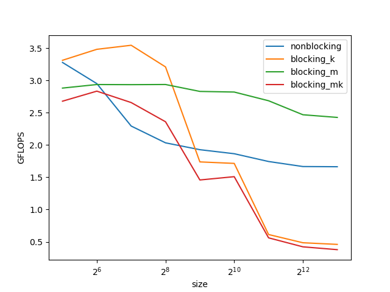

= 11 Data Locality

== 11.1 Matrix-Matrix Multiplication

image::performance.png[]

mkn and kmn perform significantly better than the other implementations for matrix-matrix multiplication. 
mkn is so good because we reuse the values in A in the inner most loop:

[source,cpp]
io_C[l_m * i_n + l_n] += i_A[l_m * i_k + l_k] * i_B[l_k * i_n + l_n];

`+i_A[l_m * i_k + l_k]+` is reused for every l_n. +
`+i_B[l_k * i_n + l_n]+` is also decent as it is linear in memory so the memory lines get a lot of values at once.

== 11.2 Blocking

// TODO : Cache Levels