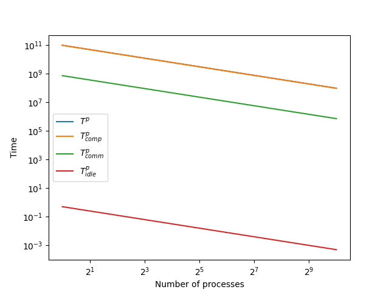

= Performance Metrics
:hardbreaks-option:

== 12.1 Amdahl's Law

=== 12.1.1 Beispielrechnungen

α~A~ = 0.6
α~B~ = 0.8
α~C~ = 0.5
S(α~A~, 2) 1.4285714285714286
S(α~B~, 2) 1.6666666666666667
S(α~C~, 2) 1.3333333333333333
S(α~A~, 4) 1.8181818181818181
S(α~B~, 4) 2.5
S(α~C~, 4) 1.6
S(α~A~, 8) 2.1052631578947367
S(α~B~, 8) 3.333333333333334
S(α~C~, 8) 1.7777777777777777
S(α~A~, 16) 2.2857142857142856
S(α~B~, 16) 4.000000000000001
S(α~C~, 16) 1.8823529411764706
S(α~A~, 64) 2.442748091603053
S(α~B~, 64) 4.7058823529411775
S(α~C~, 64) 1.9692307692307693

=== 12.1.2 Grafik

We see that all processes get a maximum speedup of 1/(1-alpha), because the non parallisable part of the program is still there and can't be reduced by more processors.

== 12.2 Gustafson's Law

=== 12.2.1 & 12.2.2 Beispielrechnungen

α = 0.6

64 ressources: S(0.8,64) 51.400000000000006
64 ressources: E(0.8,64) 0.8031250000000001

=== 12.2.3 Grafik

We see that the speedup grows approximately linear with the number of processes and the efficiency drops rather quickly down to α.

=== 12.2.4 Einfluss von α

The larger alpha is, the faster the speedup graph grows linearly. The optimal number of processors for only speedup is still the maximum you can gather no matter the alpha.
The efficiency is a different story, the lower alpha is (assuming you want to hit at least x% efficiency) the less processes you may maximally use for your cause. While with α=0.8 you may take as many as you want, with α= 0.4 you may want to limit the number of processors to at most 5, so you stay above 50% efficiency for example.

== 12.3

=== 12.3.1 Plot

=== 12.3.2 Observations

The executiontime (hidden behind T^p^~comp~ in the graph) is dominated by the computation time. The communication and idle time are insignificant by proportion.

The computation time is significantly larger than the communication time. Since the T^p^~comp~ e O(N^3^) and T^p^~comm~ e O(N^2^), the computation time grows faster than the communication time, the communication time is only larger as N is smaller than 6 (the constant factor for the communication time).